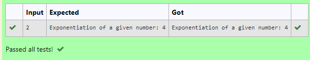

# Find the exponentiation of a number

## AIM:
To write a program to find the exponentiation of a number.

## Equipments Required:
1. Hardware – PCs
2. Anaconda – Python 3.7 Installation / Moodle-Code Runner

## Algorithm
1. Get the input from the user.
2. Use exponentiation operator to find the exponentiation of a number.

## Program:
```
#Program to to find the Exponentiation of a number.
#Developed by: Shriram.R
#RegisterNumber: 21500599
def sq():
    x=int(input())
    a=x**2
    print("Exponentiation of a given number:",a)
    
sq()
/*
Program to find the exponentiation of a number.
Developed by: 
RegisterNumber: 
*/
```

## Output:



## Result:
Thus the program to find the exponentiation of a given number is written and verified using python programming.
